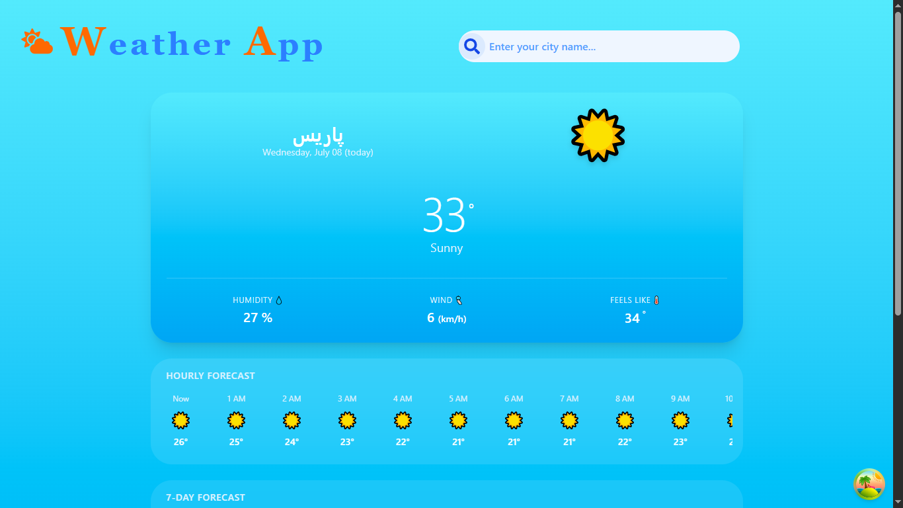

# 🌤️ Weather App

A sleek, responsive weather application built with React and Tailwind CSS. It provides real-time weather data, hourly updates, and a 7-day forecast, with a dynamic UI that changes based on the time of day.

## 🚀 Features

- 🔍 **City Search:** Search for weather conditions in any city worldwide.
- 🌓 **Dynamic Day/Night UI:** Background gradients and weather icons adapt to the time of day.
- 📅 **7-Day Forecast:** View the minimum and maximum temperatures for the upcoming week.
- ⏱️ **Hourly Forecast:** A smooth, horizontally scrollable view of hourly weather updates.
- 📱 **Fully Responsive:** Optimized for mobile, tablet, and desktop screens.
- 🛡️ **Error Handling:** Custom loading, error, and empty states.

## 🛠️ Tech Stack

- **Framework:** React
- **Styling:** Tailwind CSS
- **API:** [Open-Meteo](https://open-meteo.com/) (free, no API key required)
- **Icons:** React Icons (`react-icons/fa`)
- **Build Tool:** Vite

## 📸 Screenshots

### Desktop

| Day Mode ☀️ | Night Mode 🌙 |
| :---: | :---: |
|  |  |

### Mobile

| Night Mode 🌙 | Day Mode ☀️ |
| :---: | :---: |
|  |  |

## 🏃‍♂️ Getting Started

```bash
git clone https://github.com/alire1992/weatherApp.git
cd weatherApp
npm install
npm run dev
```

Open [http://localhost:5173](http://localhost:5173) in your browser. No API key or `.env` file is needed.

## 🌟 Possible Improvements

- [ ] **Geolocation:** Fetch weather for the user's current location.
- [ ] **Favorites:** Save multiple cities with `localStorage`.
- [ ] **Unit Toggle:** Switch between Celsius and Fahrenheit.
- [ ] **Charts:** Visualize temperature trends with Recharts.

## 🙏 Acknowledgments

- [Open-Meteo](https://open-meteo.com/) for the free weather API.

---

Made by **Alireza Saedi** · [LinkedIn](https://www.linkedin.com/in/alireza-saedi-dev/) · [GitHub](https://github.com/alire1992)