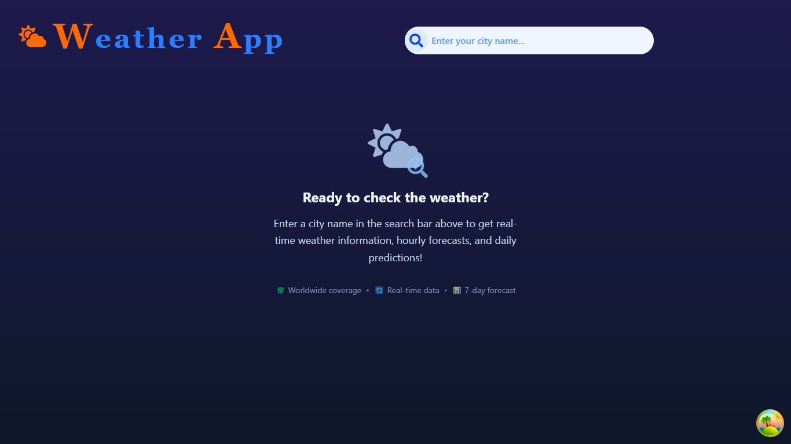
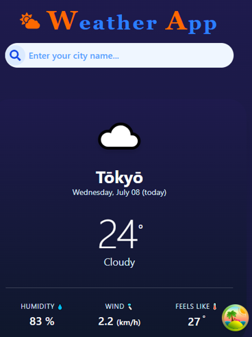
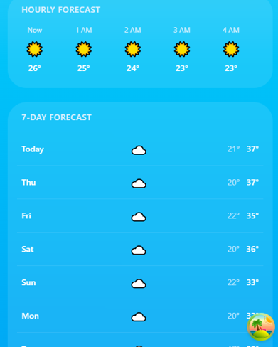

# 🌤️ Weather App

A sleek, responsive weather application built with React and Tailwind CSS. It provides real-time weather data, hourly updates, and a 7-day forecast, featuring a dynamic UI that changes based on the time of day.

## 🚀 Features

- 🔍 **City Search:** Instantly search for weather conditions in any city worldwide.
- 🌓 **Dynamic Day/Night UI:** The background gradients and weather icons automatically adapt based on local time.
- 📅 **7-Day Forecast:** View the minimum and maximum temperatures for the upcoming week.
- ⏱️ **Hourly Forecast:** A smooth, horizontally scrollable view of hourly weather updates.
- 📱 **Fully Responsive:** Optimized for mobile, tablet, and desktop screens.
- 🛡️ **Robust Error Handling:** Custom Loading, Error, and Empty states for a seamless user experience.

## 🛠️ Tech Stack

- **Frontend Framework:** React.js
- **Styling:** Tailwind CSS
- **API:** [Open-Meteo API](https://open-meteo.com/) (Free, no API key required)
- **Icons:** React Icons (`react-icons/fa`)
- **Build Tool:** Vite

## 📸 Screenshots

### Desktop View
| Day Mode ☀️ | Night Mode 🌙 |
| :---: | :---: |
|  |  |

### Mobile View
| Search & Current Weather | Hourly & Daily Forecast |
| :---: | :---: |
|  |  |


## 🌟 Future Enhancements

This project is actively maintained. Upcoming features include:
- [ ] **Geolocation:** Automatically fetch weather for the user's current location.
- [ ] **Favorites:** Save multiple cities and switch between them using LocalStorage.
- [ ] **Unit Toggle:** Switch between Celsius and Fahrenheit.
- [ ] **Advanced Charts:** Integrate `Recharts` for visual temperature trends.

## 🏃‍♂️ Getting Started

Follow these steps to run the project locally:

1. **Clone the repository:**
   ```bash
   git clone https://github.com/alire1992/weatherApp
   cd YOUR_REPO_NAME